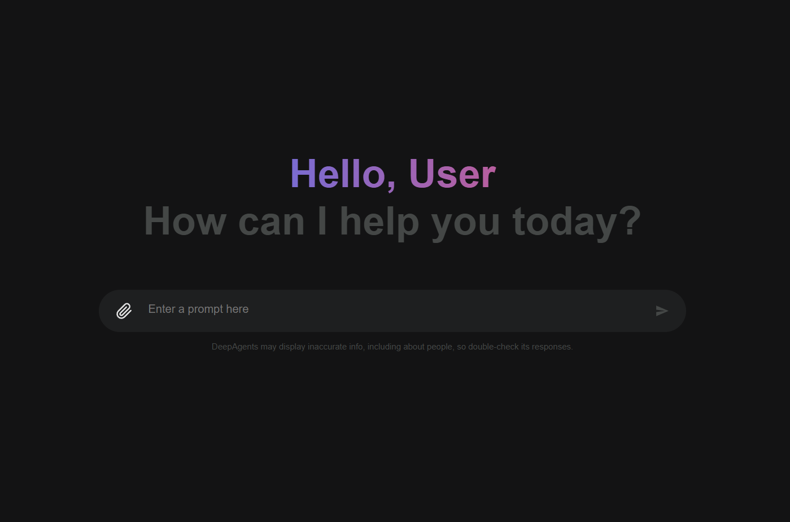

# 🤖 Deep Search Agent

> **基于 LangChain DeepAgents 框架构建的多智能体深度搜索系统** — 一个智能体编排器协调三个专家子智能体，融合互联网搜索、关系数据库与企业知识库，通过 FastAPI 提供实时 Web 服务，并内置 Planning Cache 优化模块，有效降低大模型调用成本与响应延迟。

[](https://opensource.org/licenses/MIT)
[](https://www.python.org/)
[](https://fastapi.tiangolo.com/)
[](https://www.langchain.com/)
[](https://github.com/langchain-ai/deepagents)
[]()

---

## 📸 系统界面



---

## 🏗️ 系统架构



<details>
<summary>📋 架构文字描述（点击展开）</summary>

```
┌─────────────────────────────────────────────────────────┐
│                    FastAPI Web Server                    │
│              REST API + WebSocket (实时监控)              │
└────────────────────────┬────────────────────────────────┘
                         │
         ┌───────────────▼────────────────┐
         │       Main Agent (编排器)        │
         │   - 任务规划 & 子智能体调度       │
         │   - Planning Cache 缓存加速      │
         │   - 结果整合 & 文档生成           │
         └───────┬──────┬──────┬──────────┘
                 │      │      │
    ┌────────────▼┐ ┌───▼───┐ ┌▼────────────┐
    │ 网络搜索助手  │ │数据库  │ │ RAGFlow助手 │
    │ (Tavily API) │ │(MySQL) │ │ (内部知识库) │
    └──────────────┘ └────────┘ └─────────────┘
```

</details>

---

## ✨ 核心特性

### 🤝 多智能体协作
- **智能任务分解**：主 Agent 自动将用户复杂查询拆解为可并行执行的子任务
- **3 个专家子智能体**：网络搜索助手、数据库查询助手、知识库检索助手，各司其职
- **结果自动整合**：子智能体返回结果后，主 Agent 自动汇总、去重、生成结构化报告

### 🔗 多数据源融合
| 数据源 | 实现方式 | 适用场景 |
|--------|----------|----------|
| 🌐 互联网搜索 | Tavily Search API | 行业动态、竞品分析、政策法规 |
| 🗄️ 关系数据库 | MySQL (mysql-connector-python) | 企业销售、库存、财务数据 |
| 📚 企业内部知识库 | RAGFlow SDK | SOP 文档、产品手册、技术规范 |

### 🧠 Planning Cache（核心优化模块）
- **缓存规划而非缓存答案**：同类问题的规划步骤高度同质化，将其提炼为模板缓存
- **三步流水线**：意图提取（轻量模型）→ 模板匹配（向量相似度）→ 自动学习（未命中回退）
- **效果预期**：LLM 调用成本 ↓ ~50%，响应延迟 ↓ ~30%，输出质量维持不变

### 📋 冷启动模板 + 自动学习
- **15 个预置模板**：覆盖空调/医药企业高频查询场景，系统从第 1 天起即可命中缓存
- **自动模板提取**：未命中缓存时，完整执行后自动提取新模板，持续优化命中率
- **模板持久化**：模板存储为 JSON 文件，服务重启不丢失

### 📡 实时 WebSocket 监控
- **进度透明**：前端实时查看每个 Agent 的执行进度、工具调用和中间结果
- **单例 Monitor 模式**：`ToolMonitor` 采用单例设计，工具函数中零侵入埋点
- **会话隔离**：基于 `ContextVar` 的线程级上下文，多客户端互不干扰

### 📄 多格式文档生成
- **Markdown 报告**：自动生成结构化搜索报告，含目录、数据表格、来源标注
- **PDF 导出**：通过 Word COM 自动化将 Markdown 转换为 PDF（Windows）
- **文件分析**：支持上传 txt/pdf/docx 等格式文件，Agent 可读取并分析

---

## 🧠 Planning Cache 详解

> 本项目的核心优化思路：**"缓存规划步骤，而非缓存答案"**

传统 RAG 缓存的问题是同类问题换个问法就无法命中；Planning Cache 通过缓存"解决问题的方法论"（即子任务分解和 Agent 调度策略），使不同表述的同类问题也能命中缓存。

| 步骤 | 说明 | 模型 | 延迟 |
|------|------|------|------|
| Step 1 — 意图提取 | 轻量模型提取用户问题的高层意图关键词 | Qwen2.5-14B | ~200ms |
| Step 2 — 模板匹配 | 关键词匹配 + 占位符替换，直接注入规划结果 | Qwen2.5-14B | ~150ms |
| Step 3 — 自动学习 | 未命中时走完整规划，执行后自动提取新模板 | Qwen-Max | ~2-5s |

```
用户查询 → [Step 1: 意图提取] → [Step 2: 模板匹配]
                                        │
                           ┌─ 命中 ─→ 占位符替换 → 注入规划 → 执行
                           │
                           └─ 未命中 → 完整规划(Qwen-Max) → 执行 → [Step 3: 提取模板]
```

---

## 📂 项目结构

```
deep_search_pro/
├── agent/                          # 🤖 智能体核心
│   ├── main_agent.py               #   主智能体编排器 + Planning Cache 集成
│   ├── planning_cache.py           #   规划缓存 (模板匹配/学习/持久化/相似度计算)
│   ├── cold_start_templates.py     #   15 个冷启动预置模板 (空调/医药场景)
│   ├── llm.py                      #   LLM 双模型初始化 (Qwen-Max + Qwen2.5-14B)
│   ├── prompts.py                  #   YAML 提示词加载器 (safe_load 防注入)
│   └── subagents/                  #   专家子智能体
│       ├── network_search_agent.py #     网络搜索子智能体
│       ├── database_query_agent.py #     数据库查询子智能体
│       └── knowledge_base_agent.py #     知识库检索子智能体
├── api/                            # 🌐 Web API 层
│   ├── server.py                   #   FastAPI 服务器 (REST + WebSocket + 文件上传)
│   ├── monitor.py                  #   WebSocket 实时监控 (单例 ToolMonitor)
│   └── context.py                  #   会话级上下文隔离 (ContextVar)
├── tools/                          # 🔧 Agent 工具集 (LangChain @tool)
│   ├── tavily_tool.py              #   Tavily 网络搜索工具
│   ├── db_tools.py                 #   MySQL 数据库查询工具
│   ├── ragflow_tools.py            #   RAGFlow 知识库检索工具
│   ├── markdown_tools.py           #   Markdown 报告生成工具
│   ├── pdf_tools.py                #   MD → PDF 转换工具 (Word COM)
│   └── upload_file_read_tool.py    #   多格式文件读取工具
├── prompt/
│   └── prompts.yml                 # 📝 主/子智能体 System Prompt 配置
├── rawflow/                        # 🔌 RAGFlow 集成 & 独立测试脚本
│   ├── rag_config.py               #   RAGFlow 环境变量加载
│   ├── knowledge_demo.py           #   知识库创建 & 文档上传 Demo
│   └── chat_assistant_demo.py      #   聊天助手独立测试
├── utils/                          # 🛠 工具函数
│   ├── path_utils.py               #   统一路径解析 (含安全校验)
│   └── word_converter.py           #   Word COM 自动化 (MD→PDF)
├── images/                         # 🖼 项目图片
├── requirements.txt                # Python 依赖清单
├── .env.example                    # 环境变量模板
└── LICENSE                         # MIT License
```

---

## 🚀 快速开始

### 环境要求

| 组件 | 要求 | 备注 |
|------|------|------|
| Python | 3.10+ | 必须 |
| MySQL | 8.0+ | 可选，数据库查询助手依赖 |
| RAGFlow | 0.24+ | 可选，知识库助手依赖 |
| Windows | 10+ | PDF 生成依赖 Word COM（其他功能跨平台） |

### 1. 克隆仓库

```bash
git clone https://github.com/dingzj11/deep-search-agent.git
cd deep-search-agent
```

### 2. 配置环境变量

```bash
cp .env.example .env
# 编辑 .env 文件，填入：
#   - OPENAI_API_KEY / OPENAI_BASE_URL  (DashScope 或其他 OpenAI 兼容 API)
#   - TAVILY_API_KEY                    (Tavily 搜索 API)
#   - RAGFLOW_API_URL / RAGFLOW_API_KEY (RAGFlow 服务，可选)
#   - MYSQL_USER / MYSQL_PASSWORD 等    (MySQL 数据库，可选)
```

### 3. 安装依赖

```bash
pip install -r requirements.txt
```

### 4. 启动服务

```bash
python api/server.py
```

服务启动后访问 `http://localhost:8000`。

### 5. API 使用

```bash
# 提交搜索任务
curl -X POST http://localhost:8000/api/task \
  -H "Content-Type: application/json" \
  -d '{"query": "分析2024年空调行业市场趋势"}'

# WebSocket 实时监控（返回任务执行进度）
ws://localhost:8000/ws/{thread_id}

# 带文件上传的查询
curl -X POST http://localhost:8000/api/task \
  -F "query=分析这份报告中的市场数据" \
  -F "file=@report.pdf"
```

---

## 🛠️ 技术栈

| 层级 | 技术 | 用途 |
|------|------|------|
| **Agent 框架** | [LangChain DeepAgents](https://github.com/langchain-ai/deepagents) + [LangGraph](https://github.com/langchain-ai/langgraph) | 多智能体编排、状态图、检查点 |
| **推理模型** | Qwen-Max (DashScope) | 复杂推理、信息整合、文档生成 |
| **轻量模型** | Qwen2.5-14B (DashScope) | 意图提取、模板匹配（成本为主模型的 ~1/10） |
| **Web 框架** | FastAPI + WebSocket + Uvicorn | REST API、实时推送、异步并发 |
| **搜索引擎** | [Tavily Search API](https://tavily.com/) | 互联网信息检索 |
| **知识库** | [RAGFlow SDK](https://ragflow.io/) | 企业内部知识库检索 |
| **数据库** | MySQL + mysql-connector-python | 结构化数据查询 |
| **文件生成** | Markdown (自定义) + Word COM (pywin32) | 报告生成与 PDF 导出 |
| **配置管理** | python-dotenv + PyYAML | 环境变量 + 提示词配置 |

---

## 🎯 设计亮点

1. **双模型策略**：重任务用 Qwen-Max（推理 + 整合），轻任务用 Qwen2.5-14B（意图提取 + 模板匹配），在质量与成本之间取得平衡
2. **Planning Cache 是一种 "元认知缓存"**：缓存的是"如何解决问题"的方法论，而非具体答案，泛化能力远超传统 QA 缓存
3. **会话级上下文隔离**：基于 Python `ContextVar` 实现线程安全的多客户端并发，每个连接拥有独立的执行目录和中间文件
4. **非侵入式监控**：`ToolMonitor` 单例模式，工具函数中一行代码即可埋点，无需修改 Agent 框架源码
5. **冷启动策略**：15 个预置模板保证系统上线首日就有可用的缓存，后续通过自动学习覆盖长尾场景
6. **安全编码**：YAML 使用 `safe_load` 防注入、路径统一安全校验、环境变量管理敏感信息

---

## 🤝 贡献

欢迎提交 Issue 和 Pull Request！如有问题或建议，请在 [Issues](https://github.com/dingzj11/deep-search-agent/issues) 中提出。

---

## 📄 License

MIT License — 详见 [LICENSE](LICENSE) 文件。

---

